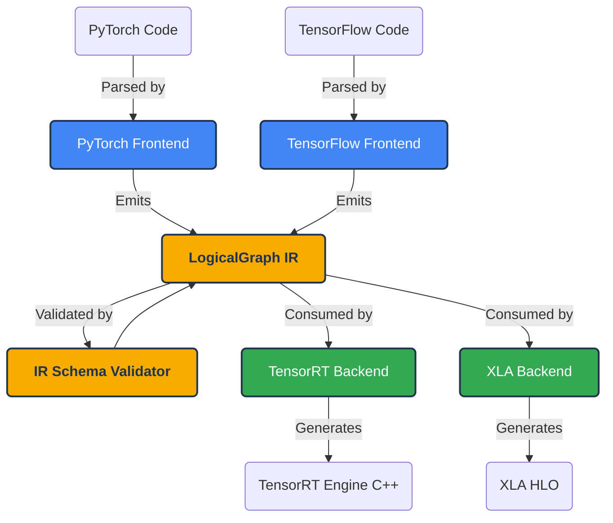

# Architecture: ml-switcheroo-ir

`ml-switcheroo-ir` serves as the critical, dependency-free bridging contract between Source Languages (Frontends) and Target Environments (Backends) within the `ml-switcheroo` ecosystem.

This document details the design choices, core abstractions, and mechanisms that power the Intermediate Representation.

## 1. High-Level Vision & Data Flow

To solve the N-to-M framework translation problem, `ml-switcheroo-ir` forces all tools to speak a common language.

## 2. Core Abstractions

The Intermediate Representation is defined by a minimal set of `dataclasses`:

*   **`LogicalGraph`**: The root container for a computational graph. It holds a flat list of nodes and a list of edges that connect them.
*   **`LogicalNode`**: An individual operation (e.g., `Gemm`, `Conv`). Nodes define their `kind` (the operator), `domain` (namespace), `version` (schema version), and `metadata` (typed attributes configuring the operation).
*   **`LogicalEdge`**: Explicit data dependencies connecting a `source` Node to a `target` Node. Explicit edges decouple the IR from relying on implicit variable naming for graph topology.
*   **`LogicalMesh` & `PartitionSpec`**: First-class abstractions allowing the IR to express distributed computing sharding maps across logical tensor dimensions, crucial for modern Large Language Model (LLM) compilation.

## 3. Design Choices & Constraints

### 3.1. Zero Dependency Policy
`ml-switcheroo-ir` must never depend on external libraries like `torch`, `onnx` (the Python library), `numpy`, or `protobuf`.

**Reasoning:** Plugin authors should be able to build a code-generation backend in a pure Python environment without forcing their users to install multi-gigabyte ML frameworks just to satisfy the IR dependency chain.

### 3.2. ONNX as the Canonical Dialect
Instead of inventing an arbitrary string schema for `LogicalNode.kind` (e.g., `"Dense"`, `"Linear"`, `"MatMul"`), `ml-switcheroo-ir` standardizes strictly on the **Open Neural Network Exchange (ONNX)** specification for operator semantics.

**Reasoning:**
1.  **Exhaustiveness:** ONNX has already solved the mathematical definitions and edge-cases for hundreds of operations.
2.  **Standardization:** It provides a common vocabulary that both PyTorch and TensorFlow communities already understand.

*Note: While we use the ONNX dialect, we do NOT use the `onnx` Protobuf format. We use our own lightweight JSON/dataclass IR.*

### 3.3. Dynamic Schema Generation
To maintain the Zero Dependency policy while enforcing ONNX rules, `ml-switcheroo-ir` dynamically builds its operator registry by parsing the official ONNX markdown documentation during its own build process (`scripts/generate_registry.py`).

This extracts operator attributes, types, and defaults, baking them into pure Python dataclasses (`onnx_registry.py`), providing runtime type safety without the overhead of protobufs.

### 3.4. Superset Extensibility
The ML ecosystem evolves faster than standard bodies. The IR uses namespaces (`LogicalNode.domain`) to allow extensions.

*   `ai.onnx`: The standard, strictly validated ONNX operator set.
*   `ml.switcheroo.custom`: Allows users to define arbitrary nodes (e.g., `FlashAttention`, `RotaryEmbedding`) via JSON schemas.

The validation engine treats custom schemas with the same rigorous type-checking as standard ONNX schemas, ensuring custom nodes don't compromise compiler stability.

## 4. The Validation Engine

Because IR generation is decoupled from compilation, invalid graphs must be caught early. The `ml_switcheroo_ir.validator` module provides structural and semantic checks:

1.  **Existence:** Does the operator `kind` exist in the specified `domain`?
2.  **Required Attributes:** Are all mandatory keys present in `metadata`?
3.  **Type Safety:** Are the values in `metadata` of the correct type (e.g., preventing a string `"1"` where an integer `1` is expected)?
4.  **Topology:** Do all `LogicalEdge` objects reference valid `LogicalNode` IDs?
5.  **Defaults:** The validator mutates the graph to inject missing optional attributes with their canonical defaults, drastically simplifying the logic required in Backend compilers.

By pushing validation into the IR layer, Frontends can confidently emit graphs, and Backends can confidently consume them, knowing the data is pristine.
