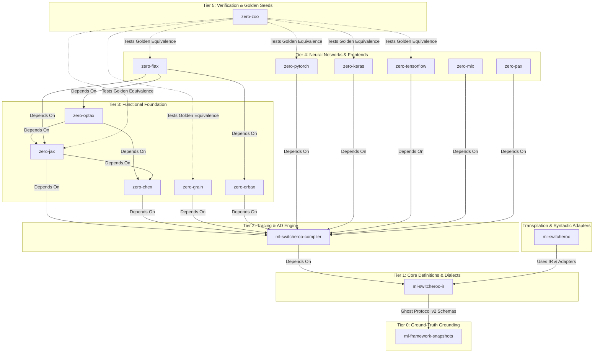
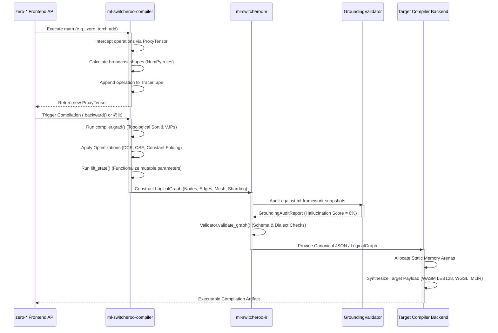

**Current Repository Context:** You are viewing the unified architecture documentation from within the `ml-switcheroo-ir` repository.

# Abstract ML Machine Ecosystem Architecture

*Note: This architecture document is shared across all repositories in the `zero-*`, `ml-switcheroo-*`, and `ml-framework-snapshots` ecosystem to provide comprehensive technical context on how the frameworks, compilers, and verification engines interoperate.*

---

## 1. The $N \times M$ Translation Problem

The Abstract ML Machine compiler ecosystem is designed to solve the classical $N \times M$ translation bottleneck in machine learning. In the absence of a canonical representation, supporting $N$ machine learning frameworks (PyTorch, JAX, Keras, TensorFlow, MLX) across $M$ execution targets (WASM, WebGPU, TensorRT, MLIR, StableHLO, CUDA) requires $N \times M$ bespoke, point-to-point translators.

```
Frontends (N)                    Canonical IR                      Backends (M)
+------------------+                                            +------------------+
| PyTorch / Keras  | \                                        / | WASM / WebGPU    |
+------------------+  \                                      /  +------------------+
| JAX / Flax       | --- [ ml-switcheroo-ir (LogicalGraph) ] --- | TensorRT / CUDA  |
+------------------+  /                                      \  +------------------+
| TensorFlow / MLX | /                                        \ | MLIR / StableHLO |
+------------------+                                            +------------------+
```

By decoupling ingestion from code generation through a strictly validated, language-agnostic Intermediate Representation (`ml-switcheroo-ir`), the complexity collapses to $N + M$.

This architecture establishes a source-to-source and source-to-binary compilation pipeline built with **strictly zero external dependencies** at runtime (relying solely on the Python Standard Library).

---

## 2. Ecosystem Repository Taxonomy

The ecosystem enforces a strictly layered, hierarchical dependency DAG. Circular dependencies are strictly forbidden.



### Component Breakdown

1. **`ml-framework-snapshots` (Tier 0)**:
   The empirical ground-truth database. Introspects and captures exact runtime function signatures, parameter kinds, default values, docstrings, and AST snapshots from official upstream framework releases (PyTorch, JAX, TensorFlow). It provides the reference manifests that eliminate LLM and compiler hallucinations.
2. **`ml-switcheroo-ir` (Tier 1)**:
   The foundational intermediate representation contract. Defines `LogicalNode`, `LogicalEdge`, `LogicalGraph`, `LogicalMesh`, distributed sharding (`PartitionSpec`), multi-dialect schema registries (ONNX, StableHLO, MLIR, Modern Custom Ops), Ghost Protocol v2 specifications, and the anti-hallucination `GroundingValidator`.
3. **`ml-switcheroo-compiler` (Tier 2)**:
   The computational execution engine. Features:
   - **`TracerTape`**: Thread-safe AOT tracing leveraging `threading.local`.
   - **`ProxyTensor`**: Overloaded Python math dunders capturing eager operations into computational tape records.
   - **AD Engine (`compiler.grad`)**: Reverse-mode automatic differentiation, topological sorting, gradient accumulation, and exact mathematical Vector-Jacobian Products (VJPs).
   - **Optimizations**: Static Shape Inference (matching NumPy broadcast rules), Dead Code Elimination (DCE), and Common Subexpression Elimination (CSE).
4. **`ml-switcheroo` (Transpilation Layer)**:
   The source-to-source Python CST/AST transformation and framework adapter layer. Rewrites concrete framework calls into canonical IR invocations or cross-compiles between framework syntaxes.
5. **`zero-*` Frontends (Tiers 3 & 4)**:
   Pure-Python, zero-dependency implementations mirroring official APIs:
   - **`zero-jax`**: Functional array operations (`jnp`, `lax`, `jit`, `grad`, `vmap`) using PyTree flattening to route state into the compiler tape.
   - **`zero-flax`**: Neural network module abstraction (`Dense`, `Conv`, `Attention`) and `nnx` state functionalization.
   - **`zero-pytorch` / `zero-keras` / `zero-tensorflow` / `zero-mlx`**: Stateful object-oriented APIs dynamically lifted to functional graphs via the compiler's `lift_state` pass.
   - **`zero-optax` / `zero-chex` / `zero-grain` / `zero-orbax`**: Optimization schedules, test assertions, deterministic data loaders, and checkpoint persistence.
6. **`zero-zoo` (Tier 5)**:
   The verification proving ground. Houses identical model architectures (MLPs, ResNets, Micro-Transformers / NanoGPT) authored identically across all `zero-*` frontends. Headless CI executes deterministic training runs asserting `.allclose()` float-for-float equivalence ("Golden Seeds") across frontends and downstream compiled artifacts.

---

## 3. Deep Dive: `ml-switcheroo-ir` Core Architecture

`ml-switcheroo-ir` acts as the strict contract between ingestion frontends and synthesis backends. It is designed around modularity, mathematical rigor, and anti-hallucination validation.

```
                                +---------------------------+
                                |        LogicalMesh        |
                                | shape: dict[str, int]     |
                                +-------------+-------------+
                                              |
                                              v
+-----------------------+       +-------------+-------------+       +-----------------------+
|      LogicalNode      | ----> |       LogicalGraph        | <---- |      LogicalEdge      |
| id: str               |       | name: str                 |       | source: str           |
| op_type / kind: str   |       | nodes: dict[str, Node]    |       | target: str           |
| domain: str           |       | nodes_list: list[Node]    |       +-----------------------+
| version: int          |       | edges: list[LogicalEdge]  |
| attributes: dict      |       | outputs: list[str]        |
| inputs: list[str]     |       | mesh: LogicalMesh | None  |
| outputs: list[str]    |       +---------------------------+
| sharding: Partition   |
| source_ast_ref: str   |
+-----------------------+
```

### 3.1. Dual-Mode Topology & Sequence Semantics

`LogicalGraph` offers a dual-access pattern ensuring full backward compatibility and ergonomic manipulation:
- **Dictionary Storage & Sequence Protocol**: Nodes are stored canonically as a `dict[str, LogicalNode]` for $O(1)$ key lookups, while also implementing `__iter__`, `__len__`, `__getitem__`, and `.nodes_list` to allow iteration in deterministic insertion or topological order.
- **Derived and Synchronized Edges**: Directed edges are derived dynamically via the `.edges` property as `list[LogicalEdge]`. Setting `.edges` synchronizes connections back into target node inputs.
- **Multi-Output & SSA Resolution**: Operations producing multiple output values (such as ONNX `Split`, `BatchNorm`, or MLIR multi-results) declare explicit SSA output names in `LogicalNode.outputs`. Downstream nodes reference outputs by name, and `LogicalGraph.get_output_producer(output_name)` resolves the producing node.

### 3.2. Distributed Sharding & Device Meshes

Distributed deep learning architectures require explicit tensor partitioning. `ml-switcheroo-ir` models distributed layout without framework baggage:
- **`LogicalMesh`**: Defines a multi-dimensional device cluster with named dimensions (e.g., `{"data": 4, "model": 2}`).
- **`PartitionSpec`**: Maps tensor dimensions to mesh axes or multi-axis tuples (e.g., `("data", None)` or `(("data", "model"),)`), matching SPMD parallel paradigms.
- **`LogicalAxis`**: Captures symbolic or fixed named dimensions.
- **Mesh Validation**: The `Validator` verifies that any sharded node resides on a graph with an active `LogicalMesh`, and that all partitioned axes exist in the mesh shape.

### 3.3. Quantization & Precision Model (`DType`)

The `DType` enumeration provides complete coverage for modern deep learning compute formats:
- **Standard Floating Point**: `float32`, `float16`, `bfloat16`, `float64`.
- **Modern FP8**: `float8_e4m3fn`, `float8_e5m2`.
- **Integer Precisions**: `int64`, `int32`, `int16`, `int8`, `uint64`, `uint32`, `uint16`, `uint8`.
- **Sub-Byte Formats**: `int4`, `uint4`, `int2`.
- **Complex & Logical**: `complex64`, `complex128`, `bool`.

### 3.4. Multi-Dialect Schema Registries

The IR incorporates built-in, zero-dependency schema registries:
1. **Canonical ONNX (`ai.onnx`)**:
   Contains 200+ canonical operators parsed directly from the official ONNX specification. Validates required/optional attributes, type constraints, and operand arities without requiring `onnx` at runtime.
2. **Modern Custom Neural Primitives (`ml.switcheroo.custom`)**:
   Pre-registers state-of-the-art transformer primitives:
   - `RMSNorm`: Inputs `["X", "weight"]`, Output `["Y"]`, Attribute `eps`.
   - `SwiGLU`: Inputs `["X"]`, Output `["Y"]`, Attribute `dim`.
   - `RoPE`: Inputs `["X", "cos", "sin"]`, Output `["Y"]`, Attribute `dim`.
   - `FlashAttention`: Inputs `["Q", "K", "V"]`, Output `["Y"]`, Attributes `causal`, `scale`.
   - `VisionPatchEmbedding`: Inputs `["X", "weight"]`, Output `["Y"]`, Attributes `patch_size`, `embed_dim`.
3. **Compiler Dialects**:
   - **`stablehlo`**: Canonical compiler operations (`dot_general`, `convolution`, `reduce`, `while`, `gather`, `scatter`, `custom_call`) with specialized attribute validation (e.g., `dot_dimension_numbers`, `window_strides`, `dimension_numbers`).
   - **Core MLIR**: Dialect validation for `arith`, `math`, `tensor`, `linalg`, `scf`, and `func`, verifying operand arities and structural separation between SSA operands and buildable attributes.

### 3.5. Anti-Hallucination Grounding & Ghost Protocol v2

To ensure LLMs and automated compilers cannot generate phantom operators or illegal attributes, `ml-switcheroo-ir` integrates Ghost Protocol v2:
- **Data Models**: `GhostRef`, `ExtendedGhostRef`, `GhostIsaRef`, `GhostMlirRef`, `GhostParam`, `GhostResult`, `SnapshotEnvelope`.
- **Hardware & Compiler Semantics**: Models operand direction (`READ`, `WRITE`, `PREDICATE`), parameter roles (`OPERAND`, `ATTRIBUTE`, `RESULT`), MLIR traits, and ISA register classes.
- **`GroundingValidator` & `audit_graph_grounding`**: Ingests ground-truth snapshot manifests from `ml-framework-snapshots`. Validates that every operation kind and attribute exists in the snapshot, computing a precise hallucination score ($0.0$ to $1.0$) and diagnosing typos or invalid parameter usage.

### 3.6. Static Compliance & AST Auditing

The built-in `compliance` engine scans Python repositories using `ast` without importing or executing external code:
- Evaluates compliance against `GraphFrontend` and `CompilerBackend` interface protocols.
- Scores framework adapter implementations against required registration and conversion methods.
- Measures dialect coverage against canonical operator registries.
- Supports generating structured markdown checklists mapping missing operations directly to API definitions (e.g., `torch.json` or `jax.json`).

---

## 4. Compilation Pipeline & End-to-End Data Flow

When user code executes across any `zero-*` frontend, computational graphs are traced, transformed, validated, and lowered through the unified pipeline:



### Trace-to-AST Linking
To deliver actionable compiler errors and facilitate syntactic round-tripping, `ml-switcheroo-compiler` links trace operations to source Python syntax trees. Using frame introspection (`inspect.currentframe()`), every `LogicalNode` emitted into the IR records a `source_ast_ref` string capturing the source file path, line number, and AST identifier.

---

## 5. Verification Gate & Quality Standards

Every repository across the ecosystem adheres to strict verification gates:

- **100% Test Coverage:** Branch and statement coverage enforced on every commit (`pytest --cov --cov-branch --cov-fail-under=100`).
- **100% Documentation Coverage:** Enforced via `interrogate --fail-under=100 src`.
- **Strict Static Typing:** Verified using `mypy --strict` with zero untyped public APIs.
- **Zero Runtime Dependencies:** Pure Python standard library implementation.
- **Git Safety Protocol:** Under no circumstances is `git push` executed autonomously.
