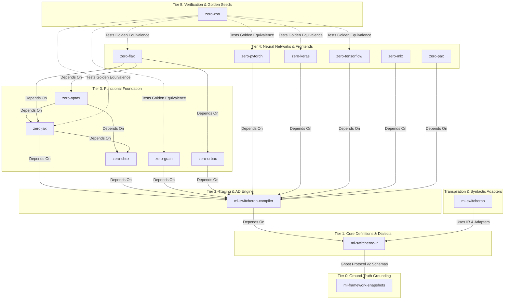
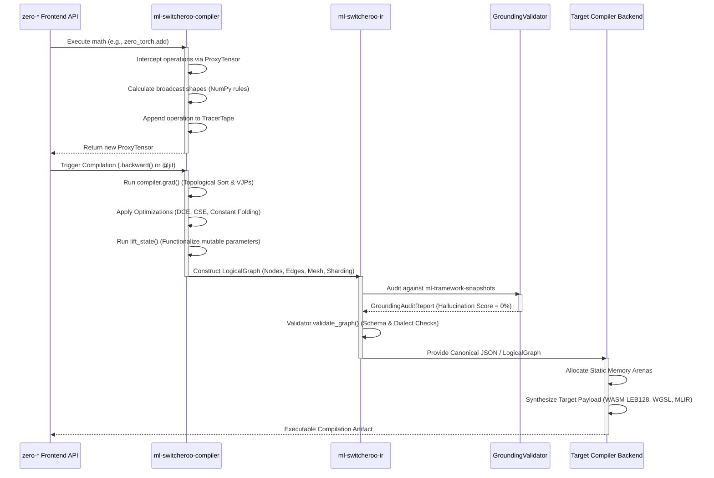

**Current Repository Context:** You are viewing the unified architecture documentation from within the `ml-switcheroo-ir` repository.

# Abstract ML Machine Ecosystem Architecture

*Note: This architecture document is shared across all repositories in the `zero-*`, `ml-switcheroo-*`, and `ml-framework-snapshots` ecosystem to provide comprehensive technical context on how the frameworks, compilers, and verification engines interoperate.*

---

## 1. The $N \times M$ Translation Problem

The Abstract ML Machine compiler ecosystem is designed to solve the classical $N \times M$ translation bottleneck in machine learning. In the absence of a canonical representation, supporting $N$ machine learning frameworks (Flax, Keras, PyTorch, MLX, JAX, TensorFlow) across $M$ execution targets (WASM, WebGPU, StableHLO, MLIR, AMD RDNA, NVIDIA SASS) requires $N \times M$ bespoke, point-to-point translators.

```
Frontends (N)                    Canonical IR                      Backends (M)
+------------------+                                            +------------------+
| Flax / Keras     | \                                        / | WASM / WebGPU    |
+------------------+  \                                      /  +------------------+
| PyTorch / MLX    | --- [ ml-switcheroo-ir (LogicalGraph) ] --- | StableHLO / MLIR |
+------------------+  /                                      \  +------------------+
| JAX / TensorFlow | /                                        \ | RDNA / SASS      |
+------------------+                                            +------------------+
```

By decoupling ingestion from code generation through a strictly validated, language-agnostic Intermediate Representation (`ml-switcheroo-ir`), the complexity collapses to $N + M$.

This architecture establishes a source-to-source and source-to-binary compilation pipeline built with **strictly zero external dependencies** at runtime (relying solely on the Python Standard Library).

---

## 2. Ecosystem Repository Taxonomy

The ecosystem enforces a strictly layered, hierarchical dependency DAG. Circular dependencies are strictly forbidden.



### Component Breakdown

1. **`ml-framework-snapshots` (Tier 0)**:
   The empirical ground-truth database. Introspects and captures exact runtime function signatures, parameter kinds, default values, docstrings, and AST snapshots from official upstream framework releases (PyTorch, JAX, TensorFlow). It provides the reference manifests that eliminate LLM and compiler hallucinations.
2. **`ml-switcheroo-ir` (Tier 1)**:
   The foundational intermediate representation contract. Defines `LogicalNode`, `LogicalEdge`, `LogicalGraph`, `LogicalMesh`, distributed sharding (`PartitionSpec`), multi-dialect schema registries (ONNX, StableHLO, MLIR, Modern Custom Ops, WebGPU WGSL, AMD RDNA, NVIDIA SASS), native IR graph transformations (DCE, CSE, shape propagation), Ghost Protocol v2 specifications, cross-framework `ParameterTranslationEngine`, and the anti-hallucination `GroundingValidator`.
3. **`ml-switcheroo-compiler` (Tier 2)**:
   The computational execution engine. Features:
   - **`TracerTape`**: Thread-safe AOT tracing leveraging `threading.local`.
   - **`ProxyTensor`**: Overloaded Python math dunders capturing eager operations into computational tape records.
   - **AD Engine (`compiler.grad`)**: Reverse-mode automatic differentiation, topological sorting, gradient accumulation, and exact mathematical Vector-Jacobian Products (VJPs).
   - **Optimizations**: Static Shape Inference (matching NumPy broadcast rules), Dead Code Elimination (DCE), and Common Subexpression Elimination (CSE).
4. **`ml-switcheroo` (Transpilation Layer)**:
   The source-to-source Python CST/AST transformation and framework adapter layer. Rewrites concrete framework calls into canonical IR invocations or cross-compiles between framework syntaxes.
5. **`zero-*` Frontends (Tiers 3 & 4)**:
   Pure-Python, zero-dependency implementations mirroring official APIs:
   - **`zero-jax`**: Functional array operations (`jnp`, `lax`, `jit`, `grad`, `vmap`) using PyTree flattening to route state into the compiler tape.
   - **`zero-flax`**: Neural network module abstraction (`Dense`, `Conv`, `Attention`) and `nnx` state functionalization.
   - **`zero-pytorch` / `zero-keras` / `zero-tensorflow` / `zero-mlx`**: Stateful object-oriented APIs dynamically lifted to functional graphs via the compiler's `lift_state` pass.
   - **`zero-optax` / `zero-chex` / `zero-grain` / `zero-orbax`**: Optimization schedules, test assertions, deterministic data loaders, and checkpoint persistence.
6. **`zero-zoo` (Tier 5)**:
   The verification proving ground. Houses identical model architectures (MLPs, ResNets, Micro-Transformers / NanoGPT) authored identically across all `zero-*` frontends. Headless CI executes deterministic training runs asserting `.allclose()` float-for-float equivalence ("Golden Seeds") across frontends and downstream compiled artifacts.

---

## 3. Deep Dive: `ml-switcheroo-ir` Core Architecture

`ml-switcheroo-ir` acts as the strict contract between ingestion frontends and synthesis backends. It is designed around modularity, mathematical rigor, and anti-hallucination validation.

```
                                +-------------------------------+
                                |          LogicalMesh          |
                                | shape: dict[str, int]         |
                                +---------------+---------------+
                                                |
                                                v
+-----------------------------+ +---------------+---------------+ +-----------------------------+
|         LogicalNode         | |         LogicalGraph          | |         LogicalEdge         |
| id: str                     | | name: str                     | | source: str                 |
| op_type / kind: str         | | nodes: NodeDict               | | target: str                 |
| domain: str                 | | inputs: list[str]             | | source_idx: int = 0         |
| version: int                | | input_specs: dict[str, Spec]  | | target_idx: int = 0         |
| attributes: dict[str, Any]  | | outputs: list[str]            | | value_name: str | None      |
| inputs: list[str]           | | initializers: dict[str, Any]  | +-----------------------------+
| outputs: list[str]          | | mesh: LogicalMesh | None      |
| shape_metadata: tuple | None| | edges: EdgeList               |
| dtype: DType | None         | | nodes_list: list[LogicalNode] |
| output_specs: list[Spec]    | +-------------------------------+
| sharding: PartitionSpec     |
| subgraphs: dict[str, Graph] |
| device: str | None          |
| stream: str | None          |
| source_ast_ref: str | None  |
+-----------------------------+
```

### 3.1. Dual-Mode Topology, Sequence Semantics & High-Throughput Streaming

`LogicalGraph` offers a dual-access pattern ensuring backward compatibility and high-performance graph manipulation:
- **`NodeDict` Storage & Sequence Protocol**: Nodes are stored canonically as a `NodeDict` providing $O(1)$ key lookups by ID, while implementing standard sequence ergonomics (`__iter__`, `__len__`, `__getitem__`, integer indexing, and `.nodes_list`) in deterministic insertion order.
- **Derived and Synchronized Edges**: Directed edges are derived dynamically via the `.edges` property as an `EdgeList`. Setting or modifying edges synchronizes connections directly into target node inputs.
- **Multi-Output & SSA Resolution**: Operations producing multiple output values (such as ONNX `Split`, `BatchNorm`, or MLIR multi-results) declare explicit SSA output names in `LogicalNode.outputs`. Downstream nodes reference outputs by SSA name, and `LogicalGraph.get_output_producer(output_name)` resolves the producing node.
- **Nested Subgraphs**: First-class support for hierarchical control flow (`body`, `then`, `else`), custom autodiff (`bwd`, `jvp`), and activation checkpointing via `LogicalNode.subgraphs: dict[str, LogicalGraph]`, supporting full recursive serialization and traversal.
- **High-Throughput Streaming & Compression**: Graphs support zero-copy streaming deserialization (`to_stream`, `from_json`) and compressed disk I/O (`to_file`, `from_file`) supporting uncompressed JSON, gzip (`.gz`), and zstandard (`.zst`) without allocating monolithic in-memory JSON strings.

### 3.2. Distributed Sharding, Collective Semantics & Cost Modeling

Distributed deep learning architectures require explicit tensor partitioning and verifiable collective communication:
- **`LogicalMesh` & `PartitionSpec`**: Defines multi-dimensional device clusters (e.g., `{"data": 4, "model": 2}`) and maps tensor dimensions to named mesh axes or multi-axis tuples (e.g., `("data", None)` or `(("data", "model"),)`).
- **SPMD Sharding Propagation Invariants (`validate_sharding_propagation`)**:
  - *Elementwise Operations*: Verifies that binary and unary elementwise operators strictly preserve sharding specifications across operands and results.
  - *Contraction & Matrix Multiplication*: Preserves non-contracting spatial axes and ensures contracting dimensions conform to parallel reduction rules.
  - *Reductions*: Verifies that reduced tensor axes transition from partitioned to replicated (`None`).
- **Pipeline Parallelism & Activation Checkpointing (`validate_pipeline_and_checkpointing`)**:
  - Validates sequential forward stage progression, reverse stage ordering in backward passes, and explicit Point-to-Point (P2P) communication boundary crossings.
  - Verifies activation checkpoint scopes (`recompute`, `no_save`, `checkpoint_boundary`).
- **Analytical Collective Communication Cost Modeling (`estimate_communication_volume`, `estimate_graph_communication_volume`)**:
  - Analytically calculates byte-level data transfer volumes for distributed collectives:
    - $\text{AllReduce}$: $2 \cdot \frac{N-1}{N} \cdot S$
    - $\text{AllGather}$: $\frac{N-1}{N} \cdot S$
    - $\text{ReduceScatter}$: $\frac{N-1}{N} \cdot S$
    - $\text{P2P} / \text{Send} / \text{Recv}$: $S$

### 3.3. Quantization & Precision Model (`DType`)

The `DType` enumeration provides complete coverage for modern deep learning compute formats:
- **Standard Floating Point**: `float32`, `float16`, `bfloat16`, `float64`.
- **Modern FP8**: `float8_e4m3fn`, `float8_e4m3b11fnuz`, `float8_e5m2`, `fp8_e4m3fn`, `fp8_e4m3fnuz`, `fp8_e5m2`, `fp8_e5m2fnuz`.
- **Integer Precisions**: `int64`, `int32`, `int16`, `int8`, `uint64`, `uint32`, `uint16`, `uint8`.
- **Sub-Byte Formats**: `int4`, `uint4`, `int2`, `qint8`, `quint8`, `qint4`.
- **Complex & Logical**: `complex64`, `complex128`, `bool`, `string`, `object`.
- **Quantization Validation Invariants (`validate_quantization`)**: Audits `QuantizeLinear` and `DequantizeLinear` primitives, verifying scale/zero-point tensor type compatibility, axis alignment, symmetric/asymmetric bounds, and sub-byte packing invariants.

### 3.4. Multi-Dialect Schema Registries

The IR incorporates built-in, zero-dependency schema registries across deep learning, compiler, and hardware ISA levels:
1. **Canonical ONNX (`ai.onnx`)**:
   Contains 205 canonical operators derived and verified against the official ONNX specification, with zero hallucinated parameters or attributes. Validates required/optional attributes, type constraints, and operand arities without requiring `onnx` at runtime.
2. **Modern Custom Neural Primitives (`ml.switcheroo.custom`)**:
   Pre-registers state-of-the-art transformer primitives:
   - `RMSNorm`: Inputs `["X", "weight"]`, Output `["Y"]`, Attribute `eps`.
   - `SwiGLU`: Inputs `["X"]`, Output `["Y"]`, Attribute `dim`.
   - `RoPE`: Inputs `["X", "cos", "sin"]`, Output `["Y"]`, Attribute `dim`.
   - `FlashAttention`: Inputs `["Q", "K", "V"]`, Output `["Y"]`, Attributes `causal`, `scale`.
   - `VisionPatchEmbedding`: Inputs `["X", "weight"]`, Output `["Y"]`, Attributes `patch_size`, `embed_dim`.
   - `LayerNorm`, `GroupNorm`, `ScaledDotProductAttention`.
3. **Compiler Dialects**:
   - **`stablehlo`**: 118 canonical compiler operations (`dot_general`, `convolution`, `reduce`, `while`, `gather`, `scatter`, `custom_call`) with structured attribute schemas (`DotDimensionNumbersAttr`, `ConvDimensionNumbersAttr`, `GatherDimensionNumbersAttr`, `ScatterDimensionNumbersAttr`, `ComparisonDirectionAttr`, `PrecisionAttr`).
   - **Core MLIR**: Dialect validation for `arith`, `math`, `tensor`, `linalg`, `scf`, and `func`, verifying operand arities and structural separation between SSA operands and buildable attributes (e.g. `staticSizes` and `dynamicSizes` on `tensor.empty`).
4. **GPU Accelerator ISAs & Shader Dialects**:
   - **WebGPU WGSL (`webgpu_wgsl`)**: Validates `@workgroup_size` dimension limits (1–3 positive integers), address space qualifiers (`storage, read`, `storage, read_write`, `uniform`, `workgroup`), uniform buffer 16-byte struct alignment and array stride constraints, compute builtins, and mutation tracking.
   - **AMD RDNA3 / GFX11 (`amd_rdna`)**: Validates wavefront size (32 vs 64), register classes (`VGPR`, `SGPR`, `AGPR`), instruction primitives, and **VOPD Dual-Issue instruction pairing rules (`validate_vopd_pairing`)** enforcing slot X and slot Y co-issuing constraints.
   - **NVIDIA SASS (`nvidia_sass`)**: Validates register classes (`GPR`, `PRED`, `ACCUM`), memory spaces (`global`, `shared`, `constant`, `local`), instruction stall count ($0..15$), yield flags (`Y`, `-`), barrier predicates/masks, and **SASS scoreboard latency hazard detection (`validate_sass_scoreboarding`)** to identify pipeline read-after-write and write-after-read hazards.

### 3.5. Anti-Hallucination Grounding, Ghost Protocol v2 & Parameter Translation

To ensure LLMs and automated compilers cannot generate phantom operators or illegal attributes, `ml-switcheroo-ir` integrates Ghost Protocol v2:
- **Data Models**: `GhostRef`, `ExtendedGhostRef`, `GhostIsaRef`, `GhostMlirRef`, `GhostParam`, `GhostResult`, `SnapshotEnvelope`.
- **Hardware & Compiler Semantics**: Models operand direction (`READ`, `WRITE`, `PREDICATE`), parameter roles (`OPERAND`, `ATTRIBUTE`, `RESULT`), MLIR traits, and ISA register classes.
- **`GroundingValidator` & `audit_graph`**: Ingests ground-truth snapshot manifests from `ml-framework-snapshots` (over 17,000 empirical symbols). Validates that every operation kind and attribute exists in the snapshot, computing a precise hallucination score ($0.0$ to $1.0$) and surfacing Levenshtein distance typo suggestions.
- **`ParameterTranslationEngine`**: Translates parameter names and keyword arguments across frameworks (`torch`, `jax`, `tf`, `stablehlo`, `numpy`) based on empirical concept maps (`concept_map.json`). Enforces a strict zero-hallucinated-parameters policy: unmapped parameters raise exceptions unless explicit passthrough is enabled.

### 3.6. Pure-IR Graph Transformations & Optimizations

`ml-switcheroo-ir` contains native, framework-independent graph optimization passes in `ml_switcheroo_ir.transforms`:
- **Dead Code Elimination (`eliminate_dead_nodes`)**: Backward breadth-first search from explicit graph outputs, preserving operations with side-effects or mutating contracts (`Print`, `custom_call`, `storageStore`, `atomic*`). Recursively optimizes nested subgraphs.
- **Common Subexpression Elimination (`eliminate_common_subexpressions`)**: Value-numbering CSE identifying redundant computations through deterministic attribute serialization and structural input matching.
- **Shape Propagation & Constant Folding (`propagate_shapes_and_constants`)**: Propagates known dimensions, evaluates static reshape/transpose operations, and simplifies dead constant subgraphs.

### 3.7. Static Compliance & AST Auditing

The built-in `compliance` engine scans Python repositories using `ast` without importing or executing external code:
- Evaluates compliance against `GraphFrontend` and `CompilerBackend` interface protocols.
- Scores framework adapter implementations against required registration and conversion methods.
- Measures dialect coverage against canonical operator registries.
- Supports generating structured markdown checklists mapping missing operations directly to API definitions (e.g., `torch.json` or `jax.json`).

### 3.8. Canonical Schema Export & TypeScript Definitions

`ml_switcheroo_ir.export` provides schema export tools for compiler and web playground integrations:
- **Draft 2020-12 JSON Schema**: `get_json_schema()` and `export_schemas()` emit formal Draft 2020-12 conforming schemas for `LogicalGraph`, `LogicalNode`, and `SnapshotEnvelope`.
- **TypeScript Interface Generation**: `generate_typescript_definitions()` produces type-safe TypeScript interfaces mirroring `LogicalGraph`, `LogicalNode`, `LogicalMesh`, `TensorSpec`, and `DType`.

### 3.9. CLI Tooling & Operational Workflows

The repository exposes a complete CLI (`ml-switcheroo-ir` / `python -m ml_switcheroo_ir`):
- `validate`: Validate graphs against operator schema registries and custom extensions.
- `ground`: Audit graphs against `ml-framework-snapshots` manifests for hallucination scoring.
- `compliance`: Static AST compliance and dialect coverage scan of downstream codebases.
- `toposort`: Deterministic topological sorting and cycle detection of JSON graphs.
- `verify-backend`: Validate external classes against `CompilerBackend` interface requirements.
- `list-ops`: Discover and search registered operators across domains.
- `dump-snapshot`: Dump package symbols and methods to GhostRef JSON format.
- `export-schema`: Export Draft 2020-12 JSON schemas and TypeScript definitions.

---

## 4. Compilation Pipeline & End-to-End Data Flow

When user code executes across any `zero-*` frontend, computational graphs are traced, transformed, validated, and lowered through the unified pipeline:



### Trace-to-AST Linking
To deliver actionable compiler errors and facilitate syntactic round-tripping, `ml-switcheroo-compiler` links trace operations to source Python syntax trees. Using frame introspection (`inspect.currentframe()`), every `LogicalNode` emitted into the IR records a `source_ast_ref` string capturing the source file path, line number, and AST identifier.

---

## 5. Verification Gate & Quality Standards

Every repository across the ecosystem adheres to strict verification gates:

- **100% Test Coverage:** Branch and statement coverage enforced on every commit (`pytest --cov --cov-branch --cov-fail-under=100`).
- **100% Documentation Coverage:** Enforced via `interrogate --fail-under=100 src`.
- **Strict Static Typing:** Verified using `mypy --strict` with zero untyped public APIs.
- **Zero Runtime Dependencies:** Pure Python standard library implementation.
- **Git Safety Protocol:** Under no circumstances is `git push` executed autonomously.
