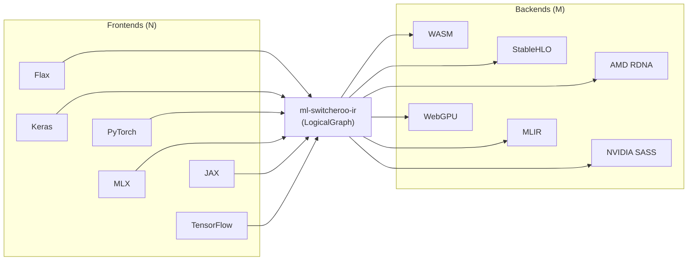

# ml-switcheroo-ir

[](https://opensource.org/licenses/Apache-2.0)
[](https://github.com/SamuelMarks/ml-switcheroo-ir/actions)
[](#)
[](#)

> The universal, zero-dependency Intermediate Representation (IR), schema validator, and anti-hallucination grounding contract for the `ml-switcheroo` and `zero-*` compilation ecosystem.

`ml-switcheroo-ir` provides the core language-agnostic data structures, multi-dialect schema registries, and interface protocols used to represent, validate, and ground neural network architectures across deep learning frameworks and compiler backends.

---

## The $N \times M$ Translation Problem

Machine learning framework interoperability suffers from an $N \times M$ translation bottleneck: translating $N$ source frameworks (Flax, Keras, PyTorch, MLX, JAX, TensorFlow) directly to $M$ execution targets (WASM, WebGPU, StableHLO, MLIR, AMD RDNA, NVIDIA SASS) requires $N \times M$ bespoke point-to-point translators.



By decoupling ingestion from code generation through a canonical, strictly validated Intermediate Representation (`ml-switcheroo-ir`), the complexity collapses to $N + M$.

---

## Ecosystem Architecture & Taxonomy

`ml-switcheroo-ir` sits at **Tier 1** of the abstract machine compilation ecosystem, serving as the foundational contract with **zero external dependencies** (using strictly the Python Standard Library):

| Ecosystem Tier | Description / Repositories |
| :--- | :--- |
| **Tier 1: Core Definitions** | `ml-switcheroo-ir` |
| **Tier 2: Computational AD** | `ml-switcheroo-compiler` (AOT Tracing, Reverse-Mode AD) |
| **Ground-Truth Grounding** | `ml-ecosystem-snapshots` (Ghost Protocol, Anti-Hallucination) |
| **Source Transpilation** | `ml-switcheroo` (CST/AST Rewriting & Framework Adapters) |
| **Tiers 3-4: zero-* Frontends** | `zero-jax`, `zero-flax`, `zero-pytorch`, `zero-keras`, `zero-tensorflow`, `zero-mlx`, `zero-pax`, `zero-optax`, `zero-chex`, `zero-grain`, `zero-orbax` |
| **Tier 5: Proving Grounds** | `zero-zoo` (Golden Seed float-for-float verification) |

### Interoperating Repositories

- **[`SamuelMarks/ml-switcheroo-ir`](https://github.com/SamuelMarks/ml-switcheroo-ir)** (This repo): Defines `LogicalNode`, `LogicalEdge`, `LogicalGraph`, `LogicalMesh`, distributed sharding (`PartitionSpec`), multi-dialect operator registries (ONNX, StableHLO, MLIR, Modern Custom Ops, WebGPU WGSL, AMD RDNA, NVIDIA SASS), native pure-IR transformations (DCE, CSE, shape propagation), `ParameterTranslationEngine`, and the `GroundingValidator`.
- **[`SamuelMarks/ml-switcheroo-compiler`](https://github.com/SamuelMarks/ml-switcheroo-compiler)**: The execution and tracing engine. Consumes `ml-switcheroo-ir` data structures, provides concurrent `TracerTape`, `ProxyTensor` tracking, reverse-mode automatic differentiation (`compiler.grad`), topological sorting, VJPs, and Dead Code Elimination (DCE).
- **[`SamuelMarks/ml-switcheroo`](https://github.com/SamuelMarks/ml-switcheroo)**: The high-level Python source-to-source framework transpiler and framework adapters that emit and ingest `ml-switcheroo-ir` graphs.
- **[`SamuelMarks/ml-ecosystem-snapshots`](https://github.com/SamuelMarks/ml-ecosystem-snapshots)** (formerly `ml-framework-snapshots`): The ground-truth reference database and Ghost Protocol generator, capturing exact runtime signatures, parameters, and AST definitions from official framework distributions to eliminate compiler hallucinations.
- **`SamuelMarks/zero-*` Framework Family**: Pure-Python, zero-dependency replicas of major machine learning frameworks:
  - **[`zero-jax`](https://github.com/SamuelMarks/zero-jax)**: Mimics `jnp`, `lax`, `jit`, `grad`, and `vmap` with PyTree flattening.
  - **[`zero-flax`](https://github.com/SamuelMarks/zero-flax)**: Neural network layers (`Dense`, `Conv`, `Attention`) and `nnx` state functionalization.
  - **[`zero-pytorch`](https://github.com/SamuelMarks/zero-pytorch)**, **[`zero-keras`](https://github.com/SamuelMarks/zero-keras)**, **[`zero-tensorflow`](https://github.com/SamuelMarks/zero-tensorflow)**, **[`zero-mlx`](https://github.com/SamuelMarks/zero-mlx)**, **[`zero-pax`](https://github.com/SamuelMarks/zero-pax)**: Stateful, object-oriented APIs dynamically lifted to functional IR graphs.
  - **[`zero-optax`](https://github.com/SamuelMarks/zero-optax)**, **[`zero-chex`](https://github.com/SamuelMarks/zero-chex)**, **[`zero-grain`](https://github.com/SamuelMarks/zero-grain)**, **[`zero-orbax`](https://github.com/SamuelMarks/zero-orbax)**: Optimization schedules, assertions, data pipelines, and checkpoint loading.
  - **[`zero-zoo`](https://github.com/SamuelMarks/zero-zoo)**: Cross-framework golden seed test suite verifying float-for-float equivalence across all frontends and backend targets.

---

## Key Features

- **Zero External Dependencies:** Implemented entirely with Python standard library modules. Can be vendored or embedded in minimal, air-gapped, or resource-constrained environments.
- **Dual-Mode Graph Topology:** Unified graph representation supporting both implicit input wiring (`LogicalNode.inputs`) and first-class directed edges (`LogicalEdge`). Nodes can be accessed via dictionary lookup (`graph["node_id"]`) or ordered sequences (`graph.nodes_list`).
- **Multi-Output & SSA Value Support:** Accurate modeling of nodes that emit multiple SSA outputs (e.g., `Split`, `BatchNorm`, `custom_call`, or multi-result MLIR operations) via `LogicalNode.outputs` and `graph.get_output_producer()`.
- **Nested Subgraphs:** Recursive hierarchical subgraphs in `LogicalNode.subgraphs` supporting control-flow constructs (`Loop`, `If`), custom autodiff (`bwd`, `jvp`), and checkpointed computational regions.
- **Distributed Sharding & Collective Modeling:** First-class tensor parallelism via `LogicalMesh`, `PartitionSpec`, and `LogicalAxis`. Includes SPMD sharding propagation validation, pipeline progression checks, and closed-form analytical communication cost estimation (`AllReduce`, `AllGather`, `ReduceScatter`, `P2P`).
- **Extensive Precision & Quantization Types (`DType`):** Standard floats and ints, sub-byte formats (`int4`, `uint4`, `int2`), modern FP8 types (`float8_e4m3fn`, `float8_e5m2`), complex numbers (`complex64`, `complex128`), and quantization invariant auditing.
- **Multi-Dialect Schema Registries:**
  - **ONNX Canonical Dialect (`ai.onnx`):** 205 canonical operators derived and grounded against the official specification with zero hallucinated attributes or parameters. Loaded dynamically from bundled JSON manifests; schema generation is strictly an offline build step (`scripts/generate_registry.py`).
  - **Modern Custom Neural Primitives (`ml.switcheroo.custom`):** Pre-registered schemas for modern transformer architectures including `RMSNorm`, `SwiGLU`, `RoPE`, `FlashAttention`, `VisionPatchEmbedding`, `LayerNorm`, `GroupNorm`, and `ScaledDotProductAttention`.
  - **StableHLO Dialect (`stablehlo`):** 118 grounded compiler operations with structured attribute schemas (`DotDimensionNumbersAttr`, `ConvDimensionNumbersAttr`, `GatherDimensionNumbersAttr`, `ScatterDimensionNumbersAttr`, `ComparisonDirectionAttr`, `PrecisionAttr`).
  - **Core MLIR Dialects:** Schema awareness and operand/attribute checking for `arith`, `math`, `tensor`, `linalg`, `scf`, and `func`.
  - **GPU Accelerator ISAs & Shader Dialects:** WebGPU WGSL (qualifiers, workgroup limits, 16-byte alignment/stride), AMD RDNA3 (GFX11 VOPD dual-issue pairing matrix), and NVIDIA SASS (scoreboard latency hazard detection).
- **Native Pure-IR Graph Transformations:** Pure Python, framework-agnostic passes in `ml_switcheroo_ir.transforms`: Dead Code Elimination (DCE) preserving side-effects/mutating ops, Common Subexpression Elimination (CSE) via value-numbering attribute hashing, and Shape Propagation/Constant Folding.
- **Zero-Hallucination Parameter Translation:** `ParameterTranslationEngine` maps parameters and attribute dictionaries across frameworks (`torch`, `jax`, `tf`, `stablehlo`, `numpy`) driven by `concept_map.json`.
- **High-Throughput Streaming & Compressed I/O:** Stream graphs directly to writable streams (`graph.to_stream(fp)`) and transparently read/write compressed files (`.gz` and `.zst`) without memory spikes.
- **Ghost Protocol v2 Integration:** Data models (`GhostRef`, `ExtendedGhostRef`, `GhostIsaRef`, `GhostMlirRef`) bridging hardware instructions, MLIR traits, and framework snapshots.
- **Anti-Hallucination Grounding Validator:** `GroundingValidator` audits IR graphs against formal manifests from `ml-ecosystem-snapshots` (over 17,000 empirical symbols), computing hallucination scores and surfacing typo suggestions.
- **JSON Schema & TypeScript Code Generation:** Emits Draft 2020-12 conforming JSON Schemas and TypeScript interfaces for playground and frontend integrations.
- **Static Compliance & Coverage Analysis:** Built-in CLI command to AST-scan downstream codebases and score compliance against IR interfaces and canonical dialects.

---

## Installation

```bash
pip install ml-switcheroo-ir
```

Or with `uv`:

```bash
uv add ml-switcheroo-ir
```

---

## Quick Start

### 1. Building a Logical Graph

```python
from ml_switcheroo_ir import (
    DType,
    LogicalGraph,
    LogicalMesh,
    LogicalNode,
    PartitionSpec,
    topological_sort,
)

# 1. Create a distributed device mesh
mesh = LogicalMesh(shape={"data": 4, "model": 2})

# 2. Define compute nodes with multi-dimensional sharding
input_node = LogicalNode(
    id="input_x",
    op_type="Input",
    domain="ai.onnx",
    attributes={"dtype": DType.float32.value},
    sharding=PartitionSpec(axes=("data", None)),
)

norm_node = LogicalNode(
    id="norm1",
    op_type="RMSNorm",
    domain="ml.switcheroo.custom",
    attributes={"eps": 1e-6},
    inputs=["input_x"],
    outputs=["norm1_out"],
)

proj_node = LogicalNode(
    id="proj1",
    op_type="Gemm",
    domain="ai.onnx",
    attributes={"alpha": 1.0, "beta": 1.0, "transB": 1},
    inputs=["norm1_out"],
    outputs=["proj1_out"],
    sharding=PartitionSpec(axes=(None, "model")),
)

# 3. Assemble and inspect the graph
graph = LogicalGraph(
    name="TransformerBlock",
    nodes={"input_x": input_node, "norm1": norm_node, "proj1": proj_node},
    outputs=["proj1_out"],
    mesh=mesh,
)

# 4. Topologically sort the computation graph
ordered_nodes = topological_sort(graph)
print([node.id for node in ordered_nodes])
# Output: ['input_x', 'norm1', 'proj1']

# 5. Access first-class edges derived from data flow
for edge in graph.edges:
    print(f"{edge.source} -> {edge.target}")
# Output:
# input_x -> norm1
# norm1_out -> proj1
```

### 2. Validating Against Operator Schemas

```python
from ml_switcheroo_ir import LogicalGraph, LogicalNode
from ml_switcheroo_ir.validator import Validator

# 1. Validate a single operator node against its canonical schema
attn_node = LogicalNode(
    id="attn",
    op_type="FlashAttention",
    domain="ml.switcheroo.custom",
    attributes={"causal": True, "scale": 0.125},
    inputs=["Q", "K", "V"],
    outputs=["attn_out"],
)

validator = Validator()
node_errors = validator.validate_node(attn_node)

if not node_errors:
    print("Node conforms perfectly to the canonical operator schema!")
else:
    for err in node_errors:
        print(f"[{err.level.value}] {err.node_id}: {err.message}")

# 2. Or validate an entire computational graph with its inputs and edges
q_node = LogicalNode(id="Q", op_type="Input")
k_node = LogicalNode(id="K", op_type="Input")
v_node = LogicalNode(id="V", op_type="Input")

graph = LogicalGraph(
    nodes={"Q": q_node, "K": k_node, "V": v_node, "attn": attn_node},
    outputs=["attn_out"],
)

graph_errors = validator.validate_graph(graph)
if not graph_errors:
    print("Graph conforms perfectly to the canonical operator schema!")
else:
    for err in graph_errors:
        print(f"[{err.level.value}] {err.node_id}: {err.message}")
```

### 3. Anti-Hallucination Grounding with `ml-ecosystem-snapshots`

```python
from ml_switcheroo_ir.validator import audit_graph_grounding

# Audit a model graph against official framework snapshots
report = audit_graph_grounding(graph, snapshots_path="path/to/snapshots.json")

print(f"Grounded: {report.grounded_count}/{report.total_nodes}")
print(f"Hallucination Score: {report.hallucination_score:.1%}")

for diagnostic in report.diagnostics:
    print(f"Diagnostic: {diagnostic.message}")
```

### 4. Deterministic JSON Serialization & Compressed Storage

```python
# Export to canonical JSON with sorted keys and explicit edge mappings
json_payload = graph.to_json(format="canonical", indent=2)

# Seamlessly deserialize from canonical or legacy list-based formats
restored_graph = LogicalGraph.from_json(json_payload)
assert len(restored_graph) == len(graph)

# High-throughput compressed disk I/O (gzip or zstandard)
graph.to_file("model.json.gz")
disk_graph = LogicalGraph.from_file("model.json.gz")
assert len(disk_graph) == len(graph)
```

### 5. Native Pure-IR Graph Transformations

```python
from ml_switcheroo_ir import (
    eliminate_common_subexpressions,
    eliminate_dead_nodes,
    propagate_shapes_and_constants,
)

# Eliminate dead nodes (preserving side-effecting operations like Print or custom_call)
clean_graph = eliminate_dead_nodes(graph)

# Eliminate identical redundant computations
deduped_graph = eliminate_common_subexpressions(clean_graph)

# Propagate static shapes and fold constant subgraphs
optimized_graph = propagate_shapes_and_constants(deduped_graph)
```

### 6. Zero-Hallucination Parameter Translation

```python
from ml_switcheroo_ir.translation import ParameterTranslationEngine

engine = ParameterTranslationEngine()

# Translate PyTorch normalization parameters to TensorFlow
tf_attrs = engine.translate_attributes(
    operation="normalization",
    attributes={"eps": 1e-5, "weight": 1.0},
    source_framework="torch",
    target_framework="tf",
)
assert tf_attrs == {"epsilon": 1e-5, "gamma": 1.0}
```

---

## Developing Frontends and Backends

### Frontend Contract (`GraphFrontend`)

Frontends (e.g. in `ml-switcheroo` or `zero-pytorch`) implement the `GraphFrontend` protocol to translate source code into a `LogicalGraph`.

```python
from ml_switcheroo_ir import GraphFrontend, LogicalGraph, LogicalNode


class MyCustomFrontend(GraphFrontend):
    def parse_to_graph(self, code: str) -> LogicalGraph:
        # Ingest and map framework operations into canonical IR nodes
        node = LogicalNode(
            id="dense",
            op_type="Gemm",
            domain="ai.onnx",
            attributes={"transB": 1},
            inputs=["x"],
        )
        return LogicalGraph(nodes={"dense": node}, outputs=["dense"])
```

### Backend Contract (`CompilerBackend`)

Backends (e.g., WASM generator, WebGPU shader synthesizers, or MLIR lowering pipelines) implement `CompilerBackend` to consume a `LogicalGraph`.

```python
from ml_switcheroo_ir import CompilerBackend, LogicalGraph


class MyCompilerBackend(CompilerBackend):
    def compile(self, graph: LogicalGraph) -> str:
        # Translate LogicalGraph into target execution payload
        instructions = []
        for node in graph.nodes_list:
            instructions.append(f"emit_{node.domain}_{node.op_type}({node.id})")
        return "\n".join(instructions)
```

---

## CLI Utilities

The package bundles the `ml-switcheroo-ir` command-line utility for CI/CD pipelines, verification, and developer tooling.

### 1. Schema Validation (`validate`)

Validates a serialized JSON graph against ONNX, StableHLO, and custom operator registries:

```bash
ml-switcheroo-ir validate model.json
```

Use `--strict` to treat warnings as errors, or `--custom-ops` to inject custom schemas:

```bash
ml-switcheroo-ir validate model.json --strict --custom-ops my_custom_ops.json
```

### 2. Snapshot Grounding Audit (`ground`)

Audits a graph against ground-truth framework snapshots (such as those from `ml-ecosystem-snapshots`) to prevent hallucinations:

```bash
ml-switcheroo-ir ground model.json --snapshots-dir /path/to/snapshots/
```

### 3. Framework Compliance Checking (`compliance`)

Performs static AST analysis on Python repositories (such as `ml-switcheroo` framework adapters or `zero-*` framework packages) to measure compliance against IR interfaces and operator coverage without importing the code:

```bash
# Measure compliance of a framework adapter
ml-switcheroo-ir compliance path/to/framework/adapter.py

# Output a markdown checklist of missing operations mapped to target definitions
ml-switcheroo-ir compliance path/to/zero_torch/ -m definitions/torch.json -v
```

### 4. Operator Discovery (`list-ops`)

Search the built-in operator registries:

```bash
# List all operators in the ai.onnx domain
ml-switcheroo-ir list-ops --domain ai.onnx

# Regex search for attention or convolution primitives
ml-switcheroo-ir list-ops --search "(Conv|Attention)"
```

### 5. Topological Sorting (`toposort`)

Validates graph acyclicity and prints nodes in deterministic execution order:

```bash
ml-switcheroo-ir toposort model.json
```

### 6. Backend Verification (`verify-backend`)

Ensures a backend class correctly implements the `CompilerBackend` interface:

```bash
ml-switcheroo-ir verify-backend src/my_backend.py CustomBackend
```

### 7. Ghost Snapshot Dump (`dump-snapshot`)

Exports all pre-registered ONNX and modern custom operator schemas to GhostRef format:

```bash
ml-switcheroo-ir dump-snapshot --output schemas_snapshot.json
```

### 8. Schema & TypeScript Export (`export-schema`)

Exports JSON Schema definitions and TypeScript interfaces for downstream consumers:

```bash
# Export JSON schemas
ml-switcheroo-ir export-schema --out-dir schemas/

# Export TypeScript definitions
ml-switcheroo-ir export-schema --typescript --ts-out types.ts
```

---

## Verification & Quality Standards

`ml-switcheroo-ir` is maintained under strict engineering standards:

- **100% Test Coverage:** Line and branch coverage enforced via `pytest --cov --cov-branch --cov-fail-under=100`.
- **100% Documentation Coverage:** Every public class, method, function, parameter, and return value documented in Google style and verified via `interrogate --fail-under=100`.
- **Strict Static Typing:** Verified with `mypy --strict`.
- **Zero Runtime Dependencies:** Pure Python standard library.

Run the test suite locally:

```bash
# Run tests
uv run pytest

# Run tests with strict coverage report
./run_test_coverage.sh
```

---

## Architectural Documentation

For deeper details regarding graph design, AST traceback linking, and dialect mappings, consult:

- [ARCHITECTURE.md](ARCHITECTURE.md): Full ecosystem architecture and data flow sequences.
- [USAGE.md](USAGE.md): Comprehensive usage, API reference, distributed modeling, and developer recipes.
- [docs/DIALECT.md](docs/DIALECT.md): ONNX dialect mapping rules for frontends.

---

## License

Licensed under either of

- Apache License, Version 2.0 ([LICENSE-APACHE](LICENSE-APACHE) or <https://www.apache.org/licenses/LICENSE-2.0>)
- MIT license ([LICENSE-MIT](LICENSE-MIT) or <https://opensource.org/licenses/MIT>)

at your option.

### Contribution

Unless you explicitly state otherwise, any contribution intentionally submitted
for inclusion in the work by you, as defined in the Apache-2.0 license, shall be
dual licensed as above, without any additional terms or conditions.
